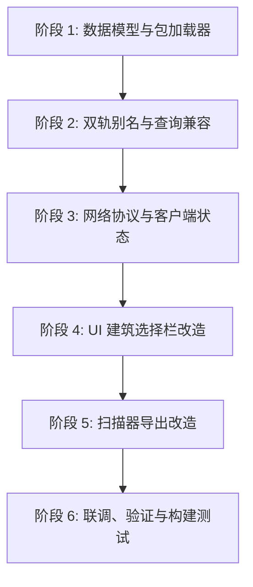

# 建筑包系统（Building Package System）设计与演进方案

> 日期：2026-09-10  
> 状态：Design Approved (via Grill-me)  
> 适用版本：Minecraft NeoForge 1.21.1  
> 关联文档：[data-formats.md](file:///D:/Projects/MCMOD/Wandscape/docs/data-formats.md), [domain-notes.md](file:///D:/Projects/MCMOD/Wandscape/docs/domain-notes.md)

---

## 一、背景与设计动机

### 1.1 现状痛点
1. **扁平全局 ID 冲突覆盖**：
   当前 `WandscapeDataLoader` 递归扫描 `data/<namespace>/buildings/**/*.json`，但在内存注册时（`BuildingConfigLoader`）仅以建筑 JSON 内声明的 `id`（如 `"cottage"`、`"farm"`）作为主键存入 `Map<String, BuildingConfig>`。如果玩家加载两个不同的第三方建筑数据包，只要两者包含同名建筑 ID，后加载的文件就会**静默覆盖**前者。
2. **建筑数量膨胀导致选择困难**：
   目前模组内置已有 50+ 个建筑。在现有的建造选择栏（`BuildingSelectionOverlay`）中，仅有单一层级的 Category 分类（`basic`, `production`, `service`, `shop`, `decoration`）。一旦未来引入中世纪、东方、现代或奇幻等不同风格风格集，Category 栏将难以承载。
3. **分发与打包缺乏聚合单元**：
   建筑扫描器（`CreativeScanner` / `ScannerExportPacket`）目前导出建筑时，只能将文件孤立地写进统一的 `wandscape_builds` 数据包中，无法成套导出、成套分发或成套分享。

### 1.2 核心设计目标
- **零侵入**：单个建筑 JSON 保持干净自治，**不需要**在每个建筑 JSON 里硬写 `packageId` 字段。
- **目录即包**：以子文件夹作为包的物理载体，文件夹内包含包描述清单 `package.json`，子目录下所有建筑自动归属于该包。
- **双轨别名兼容（Dual-key Alias）**：规范 ID 升级为 `<package_id>:<building_id>`，内置核心包（`default`）自动注册短名别名，现有存档（`BuildingSavedData`）及代码查询 100% 零断档。
- **分层级联 UI 体验**：在建筑选择栏引入包切换器，实现「包筛选 -> 类别筛选 -> 建筑选择」的直观级联交互。
- **扫描器一键打包**：扫描导出时可直接指定或新建目标包，自动生成 `package.json` 骨架。

---

## 二、架构决策（Grill-me 结论）

| 决策点 | 选定方案 | 决策理由与权衡 |
|---|---|---|
| **包的核心定位** | **多维组织与自治分发单元** | UI 维度筛选、扫描器成套打包导出、包命名空间防冲突隔离。不与复杂的硬科技树强绑定，保持模块灵活性。 |
| **包与建筑的归属关联** | **目录即包 + 包内 `package.json`** | 建筑 JSON 保持独立自治，避免迁移改名时修改大量文件。存量 50+ 个内置建筑无需任何文本改动。 |
| **ID 规范与兼容性** | **双轨别名兼容（Dual-key Alias）** | 规范名全限定 `<package_id>:<building_id>`；核心包短名映射别名；旧存档 `BuildingSavedData` 里的 `cottage` 零断档。 |
| **UI 交互层级** | **分层级联筛选** | 建筑选择栏最左侧/顶部增加包切换器，下方的分类栏（Basic、Production等）在选定包的作用域内联动筛选。 |
| **扫描器导出流程** | **UI 指定/新建目标包** | 扫描器界面增加「目标包」配置，导出直接写到对应包目录并自动生成 `package.json` 骨架。 |
| **包生命周期与安全性** | **数据包原生加载 + UI 可见性控制** | 数据层常驻加载保证世界已有存量建筑逻辑（NPC/游客）不崩溃，UI 层提供可见性与建造过滤。 |

---

## 三、数据规范与文件组织

### 3.1 物理目录结构

```text
data/<namespace>/buildings/
├── package.json                   ← 根目录默认核心包描述（可选，缺省由代码生成兜底）
├── cottage.json                   ← 根目录下文件自动归属 "default" 包
├── tavern.json
├── ...
├── medieval/                      ← 子文件夹为一个独立建筑包（包 ID 即 "medieval"）
│   ├── package.json               ← 该包的元数据描述清单
│   ├── inn.json                   ← 归属 medieval 包，规范 ID: "medieval:inn"
│   ├── blacksmith.json            ← 规范 ID: "medieval:blacksmith"
│   └── sub_folder/
│       └── watchtower.json        ← 支持递归子目录，规范 ID: "medieval:watchtower"
└── oriental/
    ├── package.json
    ├── tea_house.json             ← 规范 ID: "oriental:tea_house"
    └── pagoda.json
```

### 3.2 包元数据规范 (`package.json`)

包根目录下的 `package.json` 采用轻量格式：

```json
{
  "id": "medieval",
  "name": "wandscape.pack.medieval.name",
  "description": "wandscape.pack.medieval.desc",
  "author": "CheesePaste",
  "version": "1.0.0",
  "icon": "minecraft:stone_bricks",
  "priority": 100
}
```

#### 字段说明
- `id` (String, 必填)：包的唯一命名空间标识符，由字母、数字、下划线组成（如 `default`, `oriental`）。若省略则缺省采用当前文件夹名称。
- `name` (String, 必填)：包的显示名称，支持直接文本（如 `"中世纪小镇"`）或 I18n 键（如 `"wandscape.pack.medieval.name"`）。
- `description` (String, 选填)：包描述文本或 I18n 键。
- `author` (String, 选填)：包作者。
- `version` (String, 选填)：包版本号，如 `"1.0.0"`。
- `icon` (String, 选填)：UI 渲染用的图标。支持物品 ID（如 `"minecraft:oak_log"`）或建筑预览 ID。缺省时使用该包首个建筑的图标。
- `priority` (Integer, 选填)：在 UI 下拉/切换栏中的排序权重，数值越小越靠前。默认核心包 `default` 权重为 `0`。

### 3.3 默认核心包（Core Default Pack）
- 模组内置的 50+ 个存量建筑存放于 `data/wandscape/buildings/*.json`（即根目录），无需移动文件夹位置。
- 若没有在根目录显式提供 `package.json`，系统自动合成缺省的核心包元数据：
  - `id`: `"default"`
  - `name`: `"wandscape.pack.default.name"`（对应中文：“核心建筑包”，英文：“Core Pack”）
  - `priority`: `0`

---

## 四、核心系统与模块设计

### 4.1 数据模型定义 (`BuildingPackage`)

创建纯逻辑记录类型（不引入 MC 客户端类，便于跨端复用与单元测试）：

```java
public record BuildingPackage(
    String id,
    String name,
    String description,
    String author,
    String version,
    String iconItem,
    int priority,
    List<String> buildingIds
) {
    public static final String DEFAULT_PACK_ID = "default";
}
```

### 4.2 加载器改造 (`WandscapeDataLoader` & `BuildingConfigLoader`)

#### 1. 扫描与归属推断
在 `WandscapeDataLoader.prepareBuildings()` 中扫描 `data/<ns>/buildings/**/*.json`：
1. 提取相对路径 `relPath`（例如 `medieval/inn.json` 或 `cottage.json`）。
2. 若路径包含子目录：
   - 提取首层子目录名为 `packageId`（例如 `medieval`）。
   - 检查该目录下是否存在 `package.json`：
     - 若当前文件就是 `package.json`，则解析并注册为 `BuildingPackage` 元数据。
     - 若当前文件是建筑 JSON，则规范 ID 为 `<packageId>:<rawBuildingId>`（若 `rawBuildingId` 已包含冒号则保持）。
3. 若路径在 `buildings/` 根目录：
   - 归属包为 `default`。
   - 规范 ID 为 `default:<rawBuildingId>`。

#### 2. 双轨索引映射表
在 `BuildingConfigLoader` 内部维护两个映射表：
```java
// 全限定规范 ID 映射：如 "default:cottage" -> BuildingConfig
private final Map<String, BuildingConfig> configs = new ConcurrentHashMap<>();

// 短名别名映射：如 "cottage" -> "default:cottage"
private final Map<String, String> aliasToFullId = new ConcurrentHashMap<>();

// 包管理器元数据映射：如 "medieval" -> BuildingPackage
private final Map<String, BuildingPackage> packages = new ConcurrentHashMap<>();
```

#### 3. 兼容查询逻辑
```java
public BuildingConfig get(String id) {
    if (id == null) return null;
    // 1. 优先以全限定 ID 直接查询
    BuildingConfig cfg = configs.get(id);
    if (cfg != null) return cfg;
    
    // 2. 次选别名映射（存量存档/历史无前缀 ID 无缝穿透）
    String fullId = aliasToFullId.get(id);
    if (fullId != null) {
        return configs.get(fullId);
    }
    return null;
}
```

### 4.3 网络同步协议升级 (`ProjectionNetwork`)
客户端进入建造模式时，服务端会将建筑列表与槽位同步给客户端。
- 同步数据结构 `BuildingSlot` 中补充 `packageId` 属性（或通过网络包同时同步 `List<BuildingPackage>` 元数据列表）。
- 客户端接收后，在 `ProjectionClientState` 中建立 `Map<String, List<BuildingSlot>>` 按包索引的建筑视图。

### 4.4 UI 交互呈现 (`BuildingSelectionOverlay`)

#### 布局设计示意图
```text
┌────────────────────────────────────────────────────────────────────────┐
│ [📦 全部建筑包 ▼]  │ [全部] [基础] [生产] [市政] [商铺] [装饰]   [🔍 搜索...] │ ← 顶部栏
│────────────────────────────────────────────────────────────────────────│
│ [ 房 ] [ 井 ] [ 农 ] [ 仓 ] [ 炉 ] [ 塔 ] ...                          │ ← 建筑网格
│ [ 铺 ] [ 院 ] [ 馆 ] [ 亭 ] [ 坛 ] [ 门 ] ...                          │
└────────────────────────────────────────────────────────────────────────┘
```
- **包选择器下拉框**：
  - 位于分类标签左侧，展示当前选中的建筑包名称与图标。
  - 点击弹出轻量下拉选单，列出所有可用包：
    - `全部包 (All)`
    - `核心建筑包 (Core)`
    - `中世纪风格包 (Medieval)`
    - `自定义导出包 (Custom)`
- **联动行为**：
  - 选中特定包后，下方的分类栏和建筑网格仅展示属于该包的建筑。
  - 搜索栏在当前包的作用域内进行实时名称过滤。

### 4.5 扫描器导出交互升级 (`CreativeScannerScreen` & `ScannerExportPacket`)

1. **界面改造**：
   - `CreativeScannerScreen` 建筑信息区新增输入行：`目标包 (Package)`。
   - 提供自动补全/下拉框（列出当前已加载的所有自定义包），同时允许玩家输入新包名称（如 `steampunk`）。
2. **导出逻辑改造**：
   - `ScannerExportPacket` 接收 `targetPackage` 参数。
   - 目标目录解析为：`<world>/datapacks/wandscape_builds/data/wandscape/buildings/<targetPackage>/`。
   - 若该包目录下尚无 `package.json`，自动生成初始模板：
     ```json
     {
       "id": "<targetPackage>",
       "name": "<targetPackage>",
       "author": "<PlayerName>",
       "version": "1.0.0"
     }
     ```
   - 导出的建筑 JSON 写入该目录，并在内存中以 `<targetPackage>:<id>` 规范名与当前包建立绑定并即时注册。

---

## 五、实施步骤与阶段拆解



### 阶段 1：数据模型与核心加载器 (`BuildingPackageLoader`) [已完成]
1. 新建 `BuildingPackage.java` 数据模型。
2. 改造 `WandscapeDataLoader`：
   - 遍历 `buildings/` 时识别子目录层级，优先加载 `package.json`。
   - 为根目录内置建筑注入 `default` 核心包。
3. 单元测试验证：验证内置 50+ 个建筑正确关联至 `default` 包。

### 阶段 2：双轨别名机制与向下兼容 [已完成]
1. 改造 `BuildingConfigLoader`：
   - 引入规范 ID 格式 `<package_id>:<building_id>`。
   - 注入 `aliasToFullId`，为 `default` 包自动注入短名映射。
2. 检查现有业务引用点：
   - 验证 `BuildingSavedData` 读取历史存档（无前缀 ID）时能否正常通过 `get()` 取出。
   - 验证 NPC 寻路、游客行为、酒馆住宿等 50+ 个 `BuildingConfigLoader.get()` 调用点均无需重构。

### 阶段 3：网络同步协议适配 [已完成]
1. 在 `ProjectionNetwork` 同步包中包含包元数据或在 `BuildingSlot` 中附带 `packageId`。
2. 改造 `ProjectionClientState`：
   - 支持按包过滤与索引建筑槽位列表。

### 阶段 4：客户端建筑选择栏 UI (`BuildingSelectionOverlay`) [已完成]
1. 在 `BuildingSelectionOverlay` 增加包选择器控件（绘制与鼠标点击响应）。
2. 在 `WandscapePanelState` 维护当前选中的 `currentPackageId`（默认为 `ALL` 或 `default`）。
3. 过滤逻辑：按 `(packageId == null || slot.packageId().equals(currentPackageId))` 进行级联过滤。

### 阶段 5：扫描器成套打包与导出支持 [已完成]
1. 在 `CreativeScannerBlockEntity` 与 `CreativeScannerScreen` 增加 `targetPackage` 字段与 UI 输入框。
2. 改造 `ScannerExportPacket`：
   - 按目标包路径创建子目录。
   - 自动生成初始 `package.json`。
   - 运行时向客户端与服务端即时注册新建筑包。

### 阶段 6：回归验证与构建测试 [已完成]
1. 执行 `./gradlew build` 保证编译通过。
2. 验证存量世界存档加载兼容性与双轨别名映射。
3. 单元测试覆盖包解析、隔离、排序与运行时动态注册。

---

## 六、风险评估与防范对策

1. **同名冲突风险**：
   - *对策*：不同包内的建筑允许同名短名（如 `packA:small_house` 与 `packB:small_house`），别名映射仅在无歧义时生效；若存在多包同名短名，强制使用全限定名，避免静默覆盖。
2. **存量世界存档断档**：
   - *对策*：严格保证 `aliasToFullId` 中保留对所有历史核心建筑（`cottage`、`quarry` 等）的短名映射，现有已放置在世界中的建筑 `buildingTypeId` 无需迁移即可正常运行。
3. **国际化与玩家体验**：
   - *对策*：所有包显示名称均支持 I18n key 与纯文本双轨解析；UI 保持 Wandscape 一贯的深色卡片风格，杜绝 emoji 与装饰图标。
